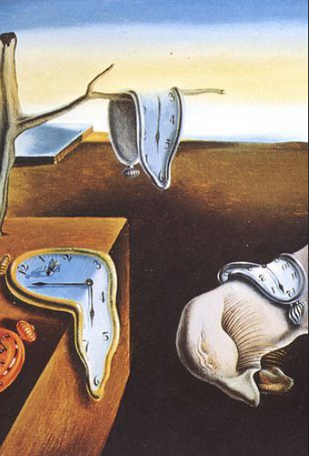

# Vison2Music vs Soundmatch

Which music fits best for an image or video? This is a subjective but highly relevant question 
for the media and ad industry. We from [LYBS](https://www.lybs.eu/) developed an AI called **Vision2Music** that suggests music to an image or video. 
To our knowledge, only Epedemic Sound has implemented a similar feature called **Soundmatch**. 
Epedemic states that Soundmatch works in the following manner:

>Soundmatch identifies what the shot in the video contains and generates relevant keywords for a semantic search. 
> Next, it uses data insight into how these keywords are typically used at scale, 
> powered by over 2.5 billion daily views of YouTube videos containing Epidemic Sound music.

This means that Soundmatch works by using two AIs: A VisionAI for identifying relevant keywords from the video and a 
MusicAI that uses these keywords to find suitable music. We developed an approach that also uses a VisionAI and a MusicAI. 
However, our AIs have a **direct neural connection** with each other. We cannot say exactly how this connection works
since it is our secret sauce.

But what is the benefit of a direct neural connection?
The benefit is that our two AIs are not limited by keywords while communicating.
We do not know how many keywords Soundmatch uses, but by using examples (you can see them in the next section) as input for Soundmatch, 
we concluded that their keywords are mainly about the **mood** of an image. Since keywords do not limit our approach, Vision2Music can musically represent almost anything in the image. 
In practice, this means that Vision2Music can also musically represent the objects inside the image. This kind of representation is called **figuration**.
Figuration allows Vision2Music to respond very differently and diversely to the same image. This means our approach works better for individualistic edge cases, 
while Epedemic's approach should work better for generic use cases.

## Examples
To give you a better idea about what we mean by individualistic edge cases, 
we provide some examples of music that our AI suggested for the images below. 

[Opera Track](https://open.spotify.com/intl-de/track/4zysbaV1tu9OD35hTz91gs) -
[EDM Track called Set The Tempo](https://open.spotify.com/intl-de/track/4Fw9pEVsvkpwyIHoVKJ6yI)

For example, for the image above, our AI, Vision2Music, suggested one opera track responding to the Monte Carlo villa 
in the background, and one highly energetic EDM track responding to the Formula 1 car. 
The [results](https://www.epidemicsound.com/music/search/soundmatch/video/?files%5B%5D=OVZWK4RPGY4DENDBHE4DEMBZMM2DIOBXG44WGY3EMUYDAY3EMEZDSZTFGIZS6ZTSMFWWKL3EMZRDENLCMMZC2YRVMJRC2NBTHFRC2ODGGI3C2MBYGJTDOOBQGZSTCN3D) 
from Epedemic can be said to be more generic. Since it mostly recommends upbeat pop and EDM music.

[Metal Track](https://open.spotify.com/intl-de/track/2HzQnBbzfJIUYIub2UlccS) - [Rebellious Protest Song](https://open.spotify.com/intl-de/track/6LH94JKGmGqakhshtsGnNz)

For this image of a tank, Vision2Music responds with a mighty metal song and a rebellious protest song.
[The results of Soundmatch](https://www.epidemicsound.com/music/search/soundmatch/video/?files%5B%5D=OVZWK4RPGY4DENDBHE4DEMBZMM2DIOBXG44WGY3EMUYDAY3EMEZDSZTFGIZS6ZTSMFWWKL3DG5TGIZJSGU2C2N3DGJSC2NBQMYYC2YTCMVSS2NZZGJRGMZBUHA3TCZDD)
are mostly heroic and epic music that would suit a new Call of Duty game well.

[Weird 1950s Electronic Piece with bleeps and bloops](https://open.spotify.com/intl-de/track/4EXt1g03wRJUGMrmdw9VYA)

Our last example image is the famous painting "The Persistence of Memory" by Salvador Dali. Vision2Music 
suggested the track "Gesang der Jünglinge." This track is a weird, avant-garde 1950s electronic piece that mixes a chopped-up 
recording of a high voice singing with bleeps and bloops. [Soundmatch](https://www.epidemicsound.com/music/search/soundmatch/video/?files%5B%5D=OVZWK4RPGY4DENDBHE4DEMBZMM2DIOBXG44WGY3EMUYDAY3EMEZDSZTFGIZS6ZTSMFWWKL3DGNTDCNJYMM3S2M3GME4C2NDEGVRC2YRYMQ2C2OJRMI4GGMTCME4TQMRZ)
on the other hand suggests mostly classical music that would suit a Disney fairy tale movie well.
